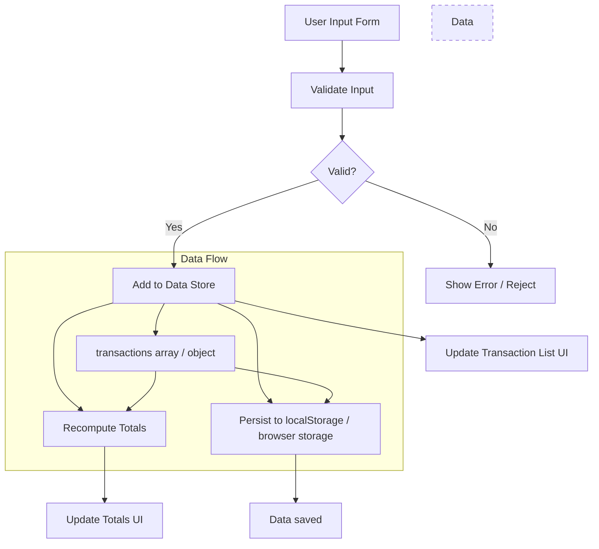

# Income Tracker (ClearSpend)

An interactive, lightweight web app to help you **track income & expenses**, visualize cash flow, and gain clarity in spending habits.  
Built using **HTML, CSS, and JavaScript**.

Live demo: [income-tracker‑ruddy.vercel.app](https://income-tracker-ruddy.vercel.app) ([github.com](https://github.com/Aman35256/Income-Tracker))

---

## Table of Contents

- [Features](#features)  
- [How It Works](#how-it-works)  
- [Architecture / Flow Diagram](#architecture--flow-diagram)  
- [Getting Started](#getting-started)  
- [Usage](#usage)  
- [Folder Structure](#folder-structure)  
- [Contributing](#contributing)  
- [License](#license)

---

## Features

- Add income and expense entries (with date, name, amount, type)  
- Persist data in browser (e.g. via `localStorage`)  
- Display totals: total income, total expenses, and balance  
- List of all entries  
- Simple, clean UI  
- Responsive (works on desktop & mobile)

---

## How It Works

1. User enters a transaction (income or expense)  
2. The JS logic validates input and adds it to a data store  
3. The UI updates to show the transaction in the list  
4. Totals (income / expense / balance) are recalculated and displayed  
5. Data persists across page reloads (using browser storage)

Here’s a flow/architecture diagram to visualize it:

### Architecture / Flow Diagram



You can embed this Mermaid diagram in GitHub’s Markdown or render via VS Code with a Markdown preview extension.

---

## Getting Started

To run this project locally:

1. **Clone** the repository  
   ```bash
   git clone https://github.com/Aman35256/Income-Tracker.git
   cd Income-Tracker
   ```

2. **Open** `index.html` in your browser  
   (You can use a local server or simply open the file)

3. (Optional) Use a live-server / local HTTP server to avoid browser restrictions on local files.

No build steps or dependencies—pure front-end, ready to go.

---

## Usage

- Enter a name, amount, date, and select “Income” or “Expense”  
- Click “Add Transaction”  
- The transaction will appear in your transaction list  
- Totals will update accordingly  
- On browser reload, your data remains intact (thanks to localStorage)

---

## Folder Structure

```
Income-Tracker/
├── index.html
├── style.css
├── script.js
├── README.md          ← (you’ll add this)
└── assets/             (optional — for icons, images, etc.)
```

- `index.html` — main HTML file  
- `style.css` — styling and layouts  
- `script.js` — core logic, event handlers, storage, UI updates  

---

## Contributing

Contributions, issues, and suggestions are welcome!  

1. Fork the repo  
2. Create your branch: `git checkout -b feature/YourFeature`  
3. Commit your changes: `git commit -m "Add feature X"`  
4. Push to branch: `git push origin feature/YourFeature`  
5. Open a Pull Request  

Please follow existing code style and keep features lightweight.

---

## License

This project is licensed under the MIT License. See the [LICENSE](LICENSE) file for details.

---

## Acknowledgments

- Inspired by many simple budgeting/expense trackers  
- Mermaid.js for diagramming  
- Browser capabilities (localStorage)
